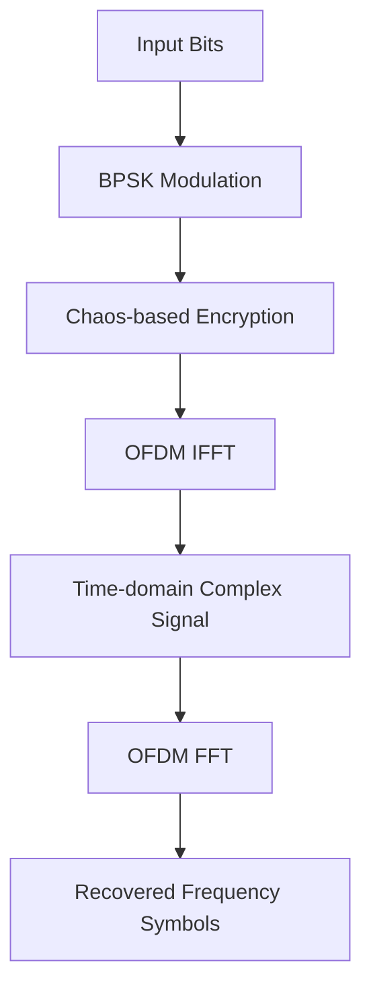

# High Performance OFDM Signal Processing Engine

<p align="center">

A modular C++17 signal processing engine with FFTW3 acceleration and benchmark-driven performance analysis.

</p>

<p align="center">


</p>


## Overview

This project reconstructs a MATLAB-based OFDM encryption prototype into a modular C++17 computational pipeline.

The goal is to explore the engineering transformation from algorithm prototypes to efficient and maintainable numerical computing systems.

The project focuses on:

- Modern C++ engineering
- Numerical computation
- Modular system design
- Performance benchmarking
- Optimization analysis


---

# Architecture




---

# Features

## Core Pipeline

- C++17 modular implementation
- BPSK modulation
- Logistic chaotic sequence generation
- Chaos-based encryption
- OFDM modulation and demodulation
- FFT/IFFT acceleration using FFTW3


## Engineering Features

- CMake-based build system
- Linux development environment
- Multi-file C++ architecture
- Benchmark framework
- Performance analysis workflow


---

# Project Structure


```
high-performance-ofdm-cpp/

├── include
│   ├── bpsk.hpp
│   ├── logistic.hpp
│   ├── encryption.hpp
│   ├── ofdm.hpp
│   └── benchmark.hpp
│
├── src
│   ├── main.cpp
│   ├── bpsk.cpp
│   ├── logistic.cpp
│   ├── encryption.cpp
│   ├── ofdm.cpp
│   └── benchmark.cpp
│
├── CMakeLists.txt
├── README.md
└── .gitignore

```

---

# Build

## Requirements

- Ubuntu / WSL Linux
- GCC
- CMake >= 3.16
- FFTW3


Install dependency:

```bash
sudo apt update

sudo apt install libfftw3-dev
```


Build:

```bash
git clone https://github.com/wwy-ustc/high-performance-ofdm-cpp.git

cd high-performance-ofdm-cpp

cmake -S . -B build

cmake --build build
```


Run:

```bash
./build/ofdm_encryption_cpp
```

---

# Benchmark


A lightweight benchmark framework is implemented to profile different computational operators.


Current configuration:

| Parameter | Value |
|---|---|
| Data size | 100000 symbols |
| Precision | double |
| FFT Library | FFTW3 |


## Baseline Performance


| Operator | Runtime |
|---|---:|
| BPSK Modulation | 3.21 ms |
| Logistic Generation | 0.87 ms |
| Encryption | 2.88 ms |
| OFDM IFFT | 4.32 ms |
| OFDM FFT | 3.11 ms |
| **Total** | **14.39 ms** |


---

# Performance Optimization


## OpenMP Parallelization Experiment


An OpenMP parallelization experiment was conducted on the encryption kernel.


The encryption operation contains independent element-wise computations, making it suitable for CPU parallel execution.


However, benchmark results showed that the parallel version was slower under the current workload.


## Result


| Version | Total Runtime |
|---|---:|
| Serial implementation | 14.39 ms |
| OpenMP experiment | 34.09 ms |


## Analysis


The performance degradation was caused by:

- thread creation overhead
- scheduling cost
- synchronization overhead


This experiment demonstrates that optimization requires:

```
Measure

   ↓

Analyze Bottleneck

   ↓

Optimize

   ↓

Benchmark Again
```

rather than simply adding parallel execution.


---

# Technical Details


## C++ Modular Architecture


Each computational operator is separated into independent modules:


```
Operator

    |

Header Interface (.hpp)

    |

Implementation (.cpp)

    |

Executable Pipeline

```


This design improves:

- maintainability
- testability
- future optimization


---

## FFTW3 Integration


The OFDM module uses FFTW3 for Fourier transform computation.


Implemented operations:


```
Frequency Domain

       |

      IFFT

       |

Time Domain

       |

       FFT

       |

Frequency Domain

```


The implementation uses:

- `std::complex<double>`
- FFTW planning mechanism
- CMake dependency management


---

# Roadmap


## Completed

- [x] C++17 project architecture
- [x] CMake build system
- [x] FFTW3 integration
- [x] OFDM FFT/IFFT pipeline
- [x] Benchmark framework
- [x] OpenMP optimization experiment


## Future

- [ ] FFTW multi-thread acceleration
- [ ] SIMD/vectorization optimization
- [ ] Large-scale profiling
- [ ] CUDA acceleration
- [ ] GPU kernel optimization


---

# Motivation


This project is an exploration of building high-performance numerical computing systems with modern C++.

The long-term goal is to bridge the gap between research algorithms and production-oriented computing infrastructure.


---

# License

MIT License